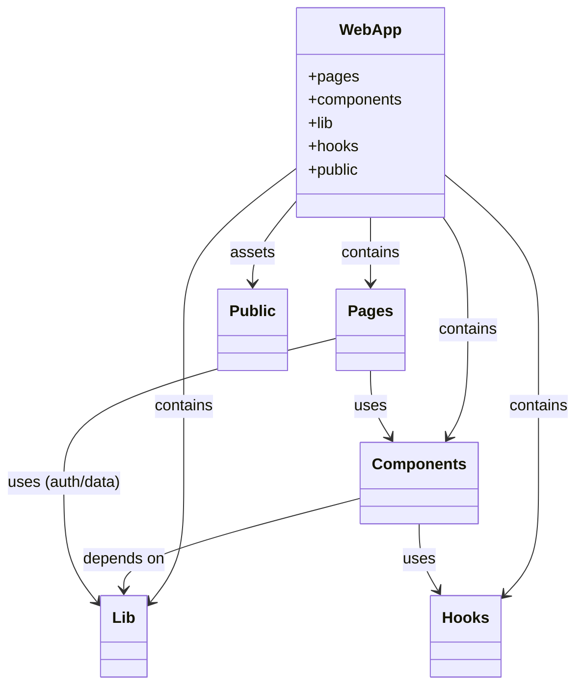
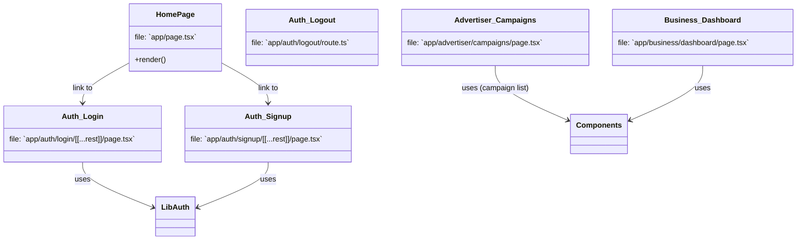
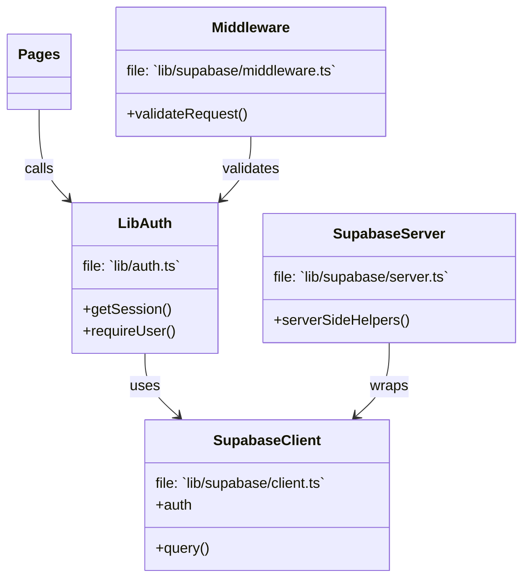
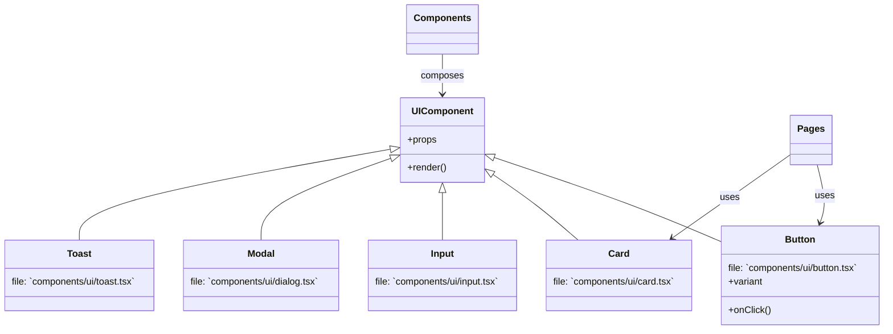
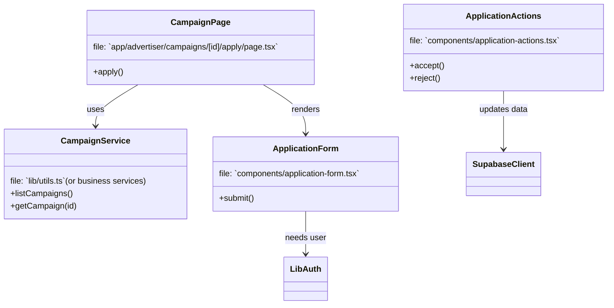

# HumanBillboard — Class Diagrams

This document contains high-level class/architecture diagrams (UML-style) represented with Mermaid so they render in Markdown viewers that support Mermaid.

Notes:
- Diagrams model modules and relationships (composition, uses, inheritance) rather than concrete TypeScript classes (the codebase is mostly functional React components). They aim to help reason about responsibilities and dependencies.
- File and route references use repository paths (e.g., `app/page.tsx`) so you can quickly jump to implementation.

## How to read these diagrams
- Boxes represent modules or conceptual classes.
- Arrows show relationships:
  - --> : uses / depends on
  - --|> : inheritance / specialization
  - <|-- : implementation / concrete component

---

## 1) High-level Architecture

This diagram shows the top-level separation: pages (routes), reusable components, library code (auth/utils/supabase), hooks, and public assets.

---

## 2) Pages & Routing (selected)

This diagram highlights a few route entry points and their dependencies on shared components and auth.

---

## 3) Data & Auth Layer

This shows the supabase-backed auth/data surface: `lib/auth.ts` uses `lib/supabase/client.ts`, and server helpers live in `lib/supabase/server.ts`.

---

## 4) UI Component Hierarchy (representative)

The actual project has many small UI components (see `components/ui/*`). This diagram groups them conceptually as specializations of a generic UI component.

---

## 5) Feature-level interactions (campaigns & applications)

This outlines how campaign pages, the application form, and application action controls interact with services and auth.

---

## Tips & next steps
- The diagrams are intentionally high-level. If you want class diagrams at the code level (methods, exact props, types), I can generate per-file diagrams for a selected subset (for example: `components/application-form.tsx`, `lib/auth.ts`) with extracted props and function signatures.
- You can render Mermaid in many Markdown previewers (VS Code Mermaid preview extension, GitHub's mermaid support in some contexts, etc.).

---

## Files referenced (quick jump list)
- `app/page.tsx` — Home page
- `app/auth/*` — Login/Signup/Onboarding/Logout
- `app/advertiser/*` — Advertiser campaign routes
- `app/business/*` — Business routes
- `components/*` — Page-specific components
- `components/ui/*` — Reusable UI atoms and molecules
- `lib/auth.ts`, `lib/supabase/*` — Auth and data layer

---

Generated on: 2025-10-28
