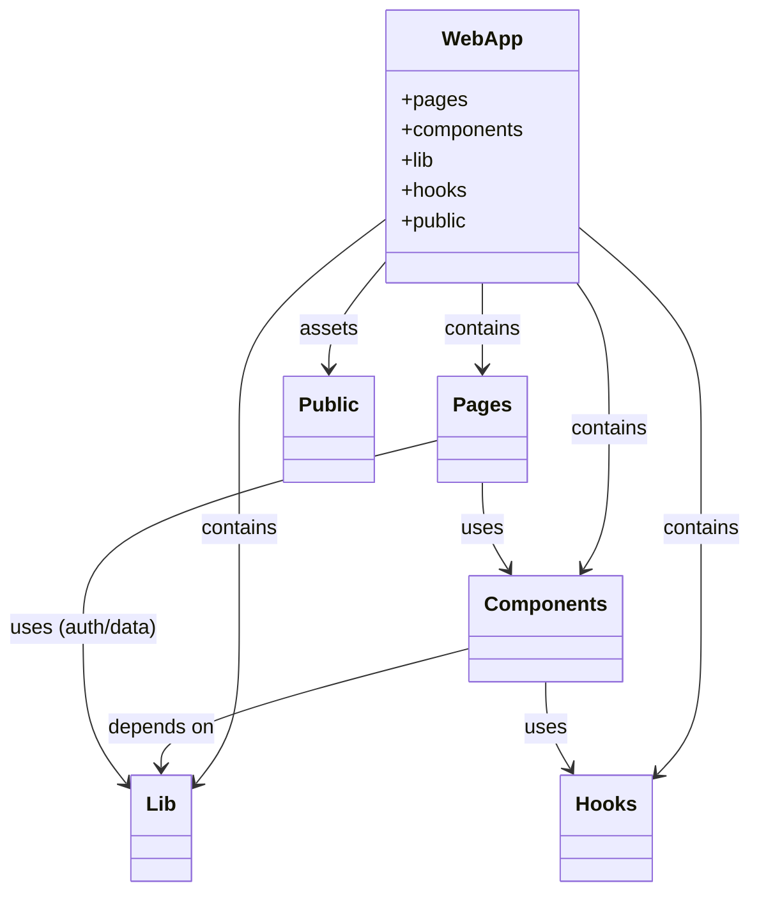

# HumanBillboard — Class Diagrams

This document contains high-level class/architecture diagrams (UML-style) represented with Mermaid so they render in Markdown viewers that support Mermaid.

Notes:
- Diagrams model modules and relationships (composition, uses, inheritance) rather than concrete TypeScript classes (the codebase is mostly functional React components). They aim to help reason about responsibilities and dependencies.
- File and route references use repository paths (e.g., `app/page.tsx`) so you can quickly jump to implementation.

## How to read these diagrams
- Boxes represent modules or conceptual classes.
- Arrows show relationships:
  - --> : uses / depends on
  - --|> : inheritance / specialization
  - <|-- : implementation / concrete component

---

## 1) High-level Architecture



This diagram shows the top-level separation: pages (routes), reusable components, library code (auth/utils/supabase), hooks, and public assets.

---

## 2) Pages & Routing (selected)

```mermaid
classDiagram
    class HomePage {
        file: `app/page.tsx`
        +render()
    }
    class Auth_Login {
        file: `app/auth/login/[[...rest]]/page.tsx`
    }
    # HumanBillboard — Minimal UML Class Diagrams (Plan A)

    This file provides a concise, high-impact set of UML-style diagrams (Mermaid) to maximize rubric points: clear classes with attributes, methods, multiplicities, and one short sequence for a common flow.

    Notes:
    - Focus: domain model, server/auth layer, one key UI component.
    - Diagrams map back to code files (file: path) so you can verify implementations quickly.

    ---

    ## 1) Domain Model — Classes & Associations

    ```mermaid
    classDiagram
        class UserProfile {
          +id: string
          +email: string
          +full_name: string
          +user_type: string
          +company_name: string
          +created_at: Date
          +getProfile(id: string): Promise<UserProfile | null>
        }

        class Campaign {
          +id: UUID
          +business_id: string
          +title: string
          +description: string
          +compensation_amount: Decimal
          +compensation_type: string
          +location: string
          +duration_hours: int?
          +status: string
          +created_at: Date
          +create(businessId: string, data): Promise<Campaign>
          +update(id: UUID, data): Promise<boolean>
        }

        class Application {
          +id: UUID
          +campaign_id: UUID
          +advertiser_id: string
          +status: string
          +message: string?
          +created_at: Date
          +submit(campaignId: UUID, advertiserId: string, message?): Promise<Application>
        }

        %% Associations with multiplicity
        UserProfile "1" -- "*" Campaign : owns
        Campaign "1" -- "*" Application : receives
        UserProfile "1" -- "*" Application : submits
    ```

    Mapping to code:
    - `user_profiles` table / `lib/auth.ts` → UserProfile
    - `campaigns` table / `components/campaign-form.tsx` → Campaign
    - `applications` table / `components/application-form.tsx` → Application

    ---

    ## 2) Server & Auth Layer — key classes / functions

    ```mermaid
    classDiagram
        class LibAuth {
          file: `lib/auth.ts`
          +auth(): Promise<{ userId?: string }>
          +getUserProfile(): Promise<UserProfile | null>
        }

        class SupabaseServer {
          file: `lib/supabase/server.ts`
          +createClient(): SupabaseClient
          +query(sql): Promise<any>
        }

        class Middleware {
          file: `middleware.ts`
          +clerkMiddleware(cb)
          +protectRoute(req): void
        }

        LibAuth --> SupabaseServer : uses
        Middleware --> LibAuth : enforces
    ```

    Notes:
    - `createClient()` is a server helper that uses `next/headers` (server-only). Represented as `SupabaseServer.createClient()`.

    ---

    ## 3) Key UI Component as Class (Props & Methods)

    ```mermaid
    classDiagram
        class CampaignForm {
          file: `components/campaign-form.tsx`
          +props: { userId: string; campaign?: Campaign }
          +handleSubmit(formData): Promise<void>
          +validate(data): Campaign
        }

        class ApplicationForm {
          file: `components/application-form.tsx`
          +props: { campaignId: UUID; advertiserId: string }
          +handleSubmit(message?): Promise<void>
        }

        CampaignForm --> Campaign : creates/updates
        ApplicationForm --> Application : creates
    ```

    UI notes:
    - Indicate client vs server: the components above are client components (use `use client`). Server actions (e.g., `app/actions/check-campaign-limit.ts`) are represented in the server diagram.

    ---

    ## 4) Short Sequence: Signup → Onboarding → Create Profile

    ```mermaid
    sequenceDiagram
        participant Browser
        participant Clerk
        participant App
        participant Supabase

        Browser->>App: GET /auth/signup (renders <SignUp />)
        Browser->>Clerk: submit credentials
        Clerk-->>Browser: create session, redirect to /auth/onboarding
        Browser->>App: GET /auth/onboarding
        App->>Clerk: auth() (server) => { userId }
        App->>Supabase: insert user_profiles { id: userId, user_type }
        Supabase-->>App: success -> redirect to dashboard
    ```

    This shows the high-level flow and where server-side `auth()` and `createClient()` are used.
