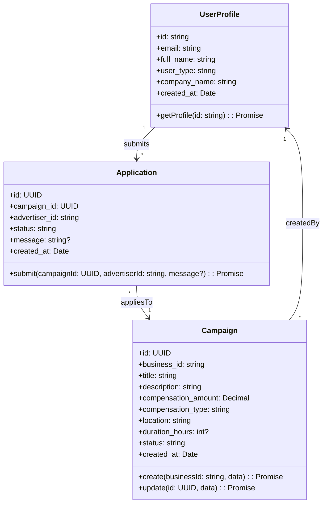
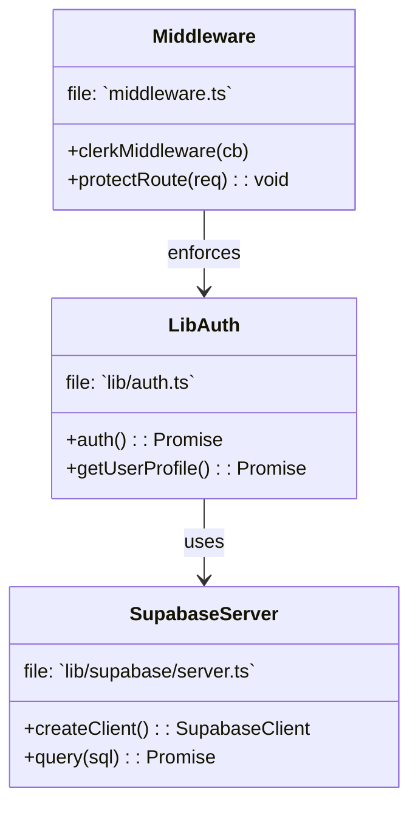
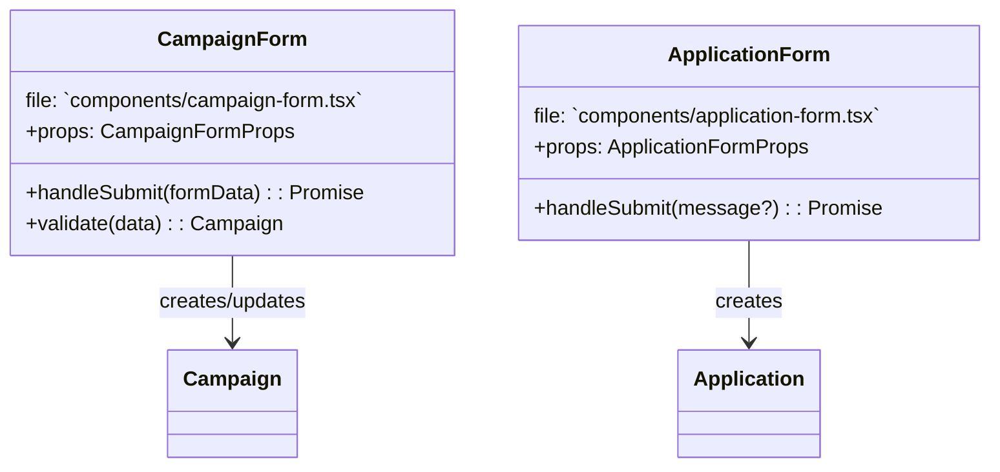
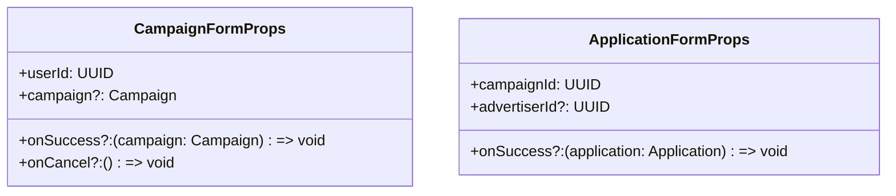

# HumanBillboard — Minimal UML Class Diagrams (Plan A)

This file provides a concise, high-impact set of UML-style diagrams (Mermaid) to maximize rubric points: clear classes with attributes, methods, multiplicities, and one short sequence for a common flow.

Notes:
- Focus: domain model, server/auth layer, one key UI component.
- Diagrams map back to code files (file: path) so you can verify implementations quickly.
---

## 1) Domain Model — Classes & Associations

Mapping to code:
- `user_profiles` table / `lib/auth.ts` → UserProfile
- `campaigns` table / `components/campaign-form.tsx` → Campaign
- `applications` table / `components/application-form.tsx` → Application

---

## 2) Server & Auth Layer — key classes / functions

Notes:
- `createClient()` is a server helper that uses `next/headers` (server-only). Represented as `SupabaseServer.createClient()`.

---

## 3) Key UI Component as Class (Props & Methods)

UI notes:
- Indicate client vs server: the components above are client components (use `use client`). Server actions (e.g., `app/actions/check-campaign-limit.ts`) are represented in the server diagram.

